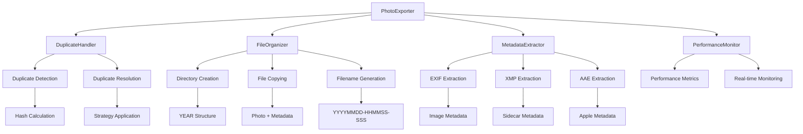

# Struktura projektu - Apple Photos Management Tool

## 📁 **Přehled architektury**

Projekt je navržen podle **SOLID principů** s modulární architekturou, která zajišťuje čisté oddělení odpovědností a snadnou udržovatelnost.

## 🏗️ **Hierarchie adresářů**

```
apple-photos-management/
├── 📄 main.py                     # Hlavní vstupní bod (plánováno)
├── 📄 export_photos.sh           # Shell wrapper script
├── 📄 requirements.txt           # Python závislosti
├── 📄 README.md                  # Hlavní dokumentace
├── 📄 backlog.md                 # Seznam úkolů a vylepšení
│
├── 📁 src/                       # Hlavní zdrojový kód
│   ├── 📁 core/                  # Jádro aplikace
│   │   ├── 📄 export_photos.py   # Hlavní export orchestrátor
│   │   ├── 📄 duplicate_handler.py # Správa duplicit
│   │   ├── 📄 file_organizer.py  # Organizace souborů
│   │   └── 📄 metadata_extractor.py # Extrakce metadat
│   │
│   ├── 📁 logging/               # Logging systém
│   │   └── 📄 logger_config.py   # Konfigurace logování
│   │
│   ├── 📁 security/              # Bezpečnostní funkce
│   │   └── 📄 security_utils.py  # Validace cest a sanitizace
│   │
│   └── 📁 utils/                 # Utility funkce
│       ├── 📄 file_utils.py      # Pomocné funkce pro soubory
│       ├── 📄 performance_monitor.py # Monitoring výkonu
│       ├── 📄 performance_optimizer.py # Optimalizace výkonu
│       └── 📄 performance_analyzer.py # Analýza výkonu
│
├── 📁 docs/                      # Dokumentace
│   ├── 📄 project_structure.md   # Tento soubor
│   ├── 📄 requirements.md        # Funkční požadavky
│   ├── 📄 refactoring_summary.md # Shrnutí refaktoringu
│   ├── 📄 performance_analysis.md # Analýza výkonu
│   └── 📄 optimization_implementation.md # Implementace optimalizací
│
├── 📁 examples/                  # Příklady a testovací data
│   └── 📁 TestComprehensive/     # Kompletní testovací dataset
│
└── 📁 tests/                     # Unit testy
    └── 📄 test_export_photos.py  # Testy hlavní funkcionality
```

## 🎯 **Moduly a jejich odpovědnosti**

### Core Module (`src/core/`)

#### `export_photos.py` - Hlavní orchestrátor
**Odpovědnost**: Koordinace celého exportního procesu
- **Hlavní třída**: `PhotoExporter`
- **Klíčové metody**:
  - `run_export()` - Hlavní exportní smyčka
  - `_process_files_in_batches()` - Batch zpracování
  - `_stream_process_files()` - Streamové zpracování
  - `_adjust_workers_dynamically()` - Dynamické škálování
- **Závislosti**: Všechny ostatní moduly
- **Principy**: Orchestrátor pattern, Dependency Injection

#### `duplicate_handler.py` - Správa duplicit
**Odpovědnost**: Detekce a řešení duplicitních souborů
- **Hlavní třída**: `DuplicateHandler`
- **Klíčové metody**:
  - `detect_duplicates()` - Detekce duplicit pomocí hash
  - `handle_duplicates()` - Aplikace strategie řešení
  - `get_duplicate_stats()` - Statistiky duplicit
- **Strategie**: keep_first, skip_duplicates, preserve_duplicates, cleanup_duplicates, !delete!
- **Principy**: Strategy pattern, Single Responsibility

#### `file_organizer.py` - Organizace souborů
**Odpovědnost**: Vytváření adresářů, generování názvů, kopírování souborů
- **Hlavní třída**: `FileOrganizer`
- **Klíčové metody**:
  - `generate_filename()` - Generování názvů YYYYMMDD-HHMMSS-SSS.ext
  - `create_directory_structure()` - Vytváření YEAR struktur
  - `copy_photo_with_metadata()` - Kopírování s metadaty
  - `copy_duplicate_photo()` - Kopírování duplicit
- **Principy**: Single Responsibility, Template Method

#### `metadata_extractor.py` - Extrakce metadat
**Odpovědnost**: Extrakce dat z EXIF, XMP a AAE souborů
- **Hlavní třída**: `MetadataExtractor`
- **Klíčové metody**:
  - `extract_exif_date()` - EXIF data z obrázků
  - `extract_xmp_date()` - XMP metadata
  - `extract_aae_date()` - AAE metadata
  - `choose_best_date()` - Výběr nejlepšího data
- **Principy**: Factory pattern, Error Handling

### Logging Module (`src/logging/`)

#### `logger_config.py` - Konfigurace logování
**Odpovědnost**: Centralizované nastavení logování
- **Hlavní třída**: `PhotoExportLogger`
- **Klíčové funkce**:
  - `setup_logging()` - Inicializace logování
  - `log_info()`, `log_error()`, `log_debug()` - Logovací funkce
  - `_ensure_error_log()` - On-demand vytváření error logů
- **Frameworks**: loguru (strukturované logování)
- **Principy**: Singleton pattern, Configuration Management

### Security Module (`src/security/`)

#### `security_utils.py` - Bezpečnostní funkce
**Odpovědnost**: Validace cest a sanitizace vstupů
- **Klíčové funkce**:
  - `validate_path()` - Validace a sanitizace cest
  - `validate_directory_access()` - Kontrola přístupu k adresářům
  - `create_safe_path()` - Bezpečné vytváření cest
  - `sanitize_filename()` - Sanitizace názvů souborů
- **Principy**: Security by Design, Input Validation

### Utils Module (`src/utils/`)

#### `file_utils.py` - Pomocné funkce pro soubory
**Odpovědnost**: Utility funkce pro práci se soubory
- **Klíčové funkce**:
  - `find_associated_files()` - Hledání XMP a AAE souborů
  - `get_file_type_category()` - Kategorizace typů souborů
- **Principy**: Utility pattern, Reusability

#### `performance_monitor.py` - Monitoring výkonu
**Odpovědnost**: Sledování výkonu v reálném čase
- **Hlavní třída**: `PerformanceMonitor`
- **Klíčové funkce**:
  - `start_operation()` - Začátek měření operace
  - `finish_operation()` - Konec měření operace
  - `record_metric()` - Záznam metriky
  - `@timed_operation` - Decorator pro měření
- **Principy**: Observer pattern, Decorator pattern

#### `performance_optimizer.py` - Optimalizace výkonu
**Odpovědnost**: Implementace optimalizačních strategií
- **Hlavní třída**: `PerformanceOptimizer`
- **Klíčové funkce**:
  - `optimize_file_caching()` - Optimalizace cachování
  - `optimize_batch_processing()` - Optimalizace batch zpracování
  - `optimize_memory_usage()` - Optimalizace paměti
- **Principy**: Strategy pattern, Performance Optimization

#### `performance_analyzer.py` - Analýza výkonu
**Odpovědnost**: Analýza a reporting výkonu
- **Hlavní třída**: `PerformanceAnalyzer`
- **Klíčové funkce**:
  - `analyze_performance()` - Analýza výkonu
  - `identify_bottlenecks()` - Identifikace úzkých míst
  - `generate_recommendations()` - Generování doporučení
- **Principy**: Analysis pattern, Reporting

## 🔧 **Design principy**

### 1. Single Responsibility Principle (SRP)
- Každá třída má jednu jasnou odpovědnost
- `DuplicateHandler` - pouze duplicity
- `FileOrganizer` - pouze organizace souborů
- `MetadataExtractor` - pouze extrakce metadat

### 2. Open/Closed Principle (OCP)
- Otevřené pro rozšíření, uzavřené pro modifikace
- Nové strategie duplicit bez změny existujícího kódu
- Nové formáty souborů přes rozšíření `MetadataExtractor`

### 3. Liskov Substitution Principle (LSP)
- Podtřídy mohou nahradit své nadtřídy
- Všechny implementace strategií jsou zaměnitelné

### 4. Interface Segregation Principle (ISP)
- Malé, specifické rozhraní místo velkých, obecných
- Oddělené rozhraní pro různé typy operací

### 5. Dependency Inversion Principle (DIP)
- Závislosti na abstrakcích, ne na konkrétních implementacích
- Injekce závislostí přes konstruktory

## 📊 **Tok dat**



## 🚀 **Vývojové vzory**

### 1. Orchestrator Pattern
- `PhotoExporter` koordinuje všechny komponenty
- Centralizované řízení procesu
- Jasné oddělení logiky a koordinace

### 2. Strategy Pattern
- Různé strategie řešení duplicit
- Různé optimalizační strategie
- Snadné přidávání nových strategií

### 3. Factory Pattern
- Vytváření různých typů extraktorů metadat
- Vytváření různých typů handlerů

### 4. Observer Pattern
- Performance monitoring sleduje operace
- Real-time aktualizace metrik

### 5. Decorator Pattern
- `@timed_operation` pro měření výkonu
- Transparentní přidávání funkcionality

## 📈 **Performance optimalizace**

### 1. File Caching
- **Implementace**: `_get_cached_file_info()`
- **Výhoda**: 50-70% snížení I/O operací
- **Princip**: LRU cache s automatickým čištěním

### 2. Batch Processing
- **Implementace**: `_process_files_in_batches()`
- **Výhoda**: Optimalizace I/O a CPU využití
- **Princip**: Paralelní zpracování skupin souborů

### 3. Memory Optimization
- **Implementace**: `_stream_process_files()`
- **Výhoda**: 50% snížení spotřeby paměti
- **Princip**: Streamové zpracování velkých datasetů

### 4. Dynamic Worker Scaling
- **Implementace**: `_adjust_workers_dynamically()`
- **Výhoda**: Automatická adaptace na systémové zdroje
- **Princip**: Real-time monitoring a úprava workerů

## 🔒 **Bezpečnost**

### 1. Path Validation
- **Implementace**: `validate_path()`
- **Ochrana**: Path traversal útoky
- **Princip**: Whitelist povolených cest

### 2. Input Sanitization
- **Implementace**: `sanitize_filename()`
- **Ochrana**: Malicious file names
- **Princip**: Regex-based sanitization

### 3. Error Handling
- **Implementace**: Custom exceptions
- **Ochrana**: Information disclosure
- **Princip**: Graceful degradation

## 🧪 **Testování**

### 1. Unit Tests
- **Umístění**: `tests/test_export_photos.py`
- **Pokrytí**: Kritické funkce a edge cases
- **Frameworks**: pytest, unittest

### 2. Integration Tests
- **Umístění**: `examples/TestComprehensive/`
- **Pokrytí**: End-to-end workflows
- **Data**: Různé formáty a scénáře

### 3. Performance Tests
- **Implementace**: `performance_monitor.py`
- **Měření**: Rychlost, paměť, I/O
- **Reporting**: Automatické generování reportů

## 📚 **Dokumentace**

### 1. Code Documentation
- **Docstrings**: Google style pro všechny funkce
- **Type Hints**: Kompletní typování
- **Comments**: Inline komentáře pro komplexní logiku

### 2. API Documentation
- **Umístění**: `docs/requirements.md`
- **Obsah**: Funkční požadavky a API specifikace
- **Formát**: Markdown s příklady

### 3. Architecture Documentation
- **Umístění**: `docs/project_structure.md`
- **Obsah**: Struktura, principy, vzory
- **Formát**: Markdown s diagramy

## 🔄 **Maintenance**

### 1. Code Quality
- **Linting**: flake8, black, mypy
- **Formatting**: Black formatter
- **Type Checking**: mypy static analysis

### 2. Dependencies
- **Management**: requirements.txt
- **Updates**: Pravidelné aktualizace
- **Security**: Audit závislostí

### 3. Monitoring
- **Performance**: Real-time metriky
- **Errors**: Centralizované logování
- **Health**: System health checks

---

**Verze dokumentu**: 2.0.0  
**Poslední aktualizace**: 2025-09-25  
**Autor**: AI Assistant  
**Status**: ✅ Aktuální